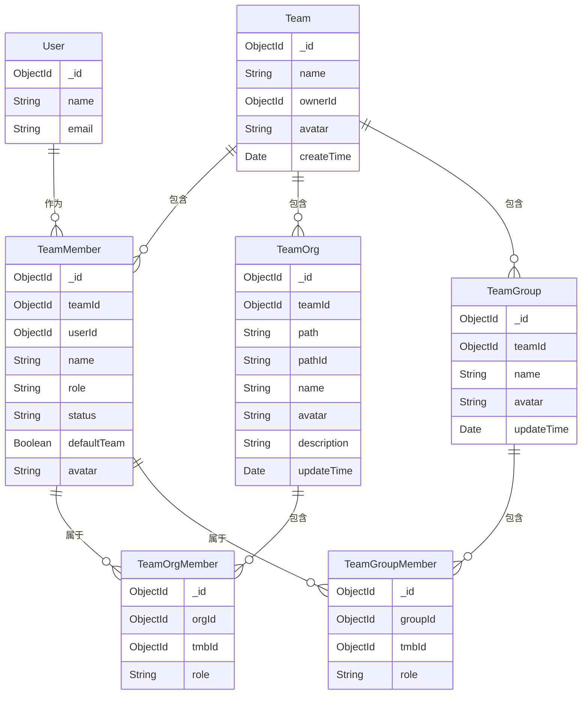
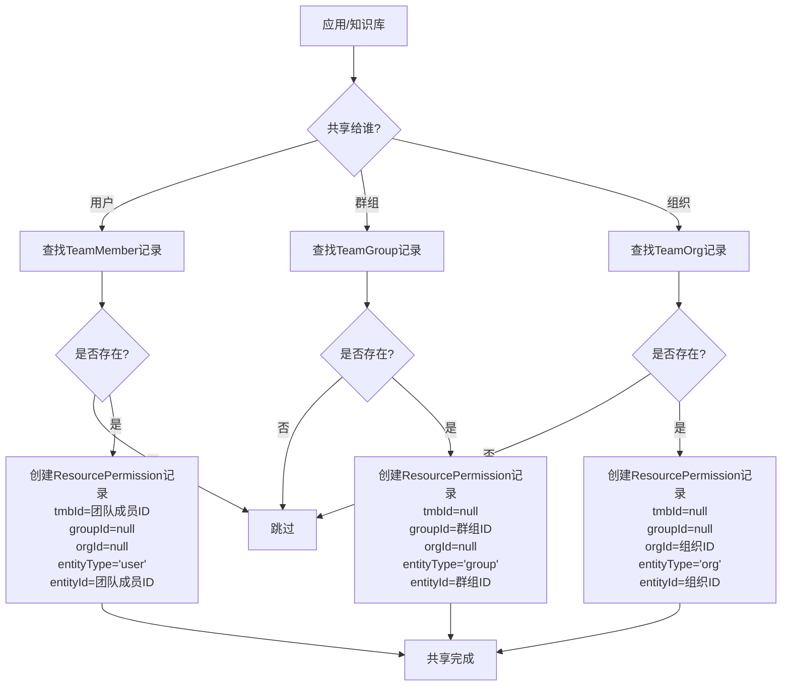
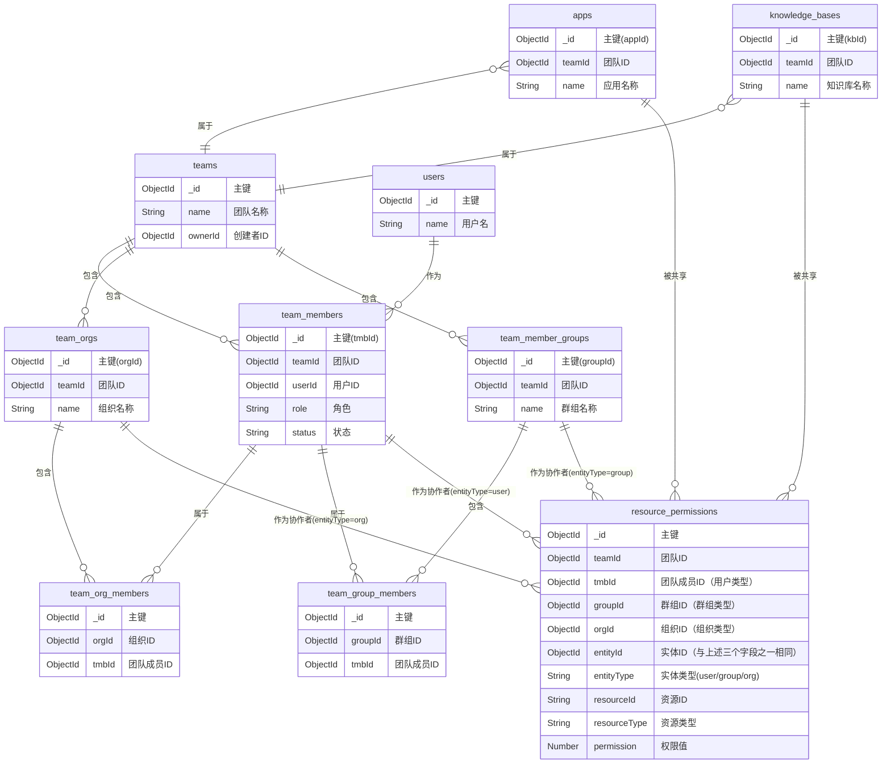

## 实体关系图

## 组织架构说明

### Org(部门)与Group(群组)的区别

1. 组织结构
   - Org(部门)：采用层级结构，通过`path`和`pathId`字段维护部门层级关系，可构建树形组织架构
   - Group(群组)：采用扁平结构，群组之间无层级关系，都是平级的

2. 权限管理
   - Group(群组)：成员有明确的角色划分(owner/admin/member)，主要用于资源权限管理
   - Org(部门)：成员无角色区分，主要用于组织架构管理

3. 业务用途
   - Org(部门)
     - 用于模拟企业的组织架构
     - 支持部门的层级管理
     - 每个团队都有一个ROOT部门作为顶级部门
     - 主要用于组织结构展示和管理
   
   - Group(群组)
     - 用于资源权限管理和协作
     - 每个团队默认有一个Default群组
     - 可以灵活创建不同的群组来管理不同资源的访问权限
     - 主要用于团队协作和资源共享

这种设计将"组织架构管理"和"权限管理"进行了分离，使系统更加灵活和清晰。

## 资源共享机制图

> **注意**：下图展示的是资源共享流程。在数据库中，我们同时使用 tmbId/groupId/orgId 和 entityType/entityId 两组字段，并通过中间件自动维护它们之间的数据一致性。

## 数据库调整说明

> 不再使用team_collaborators表，统一使用resource_permissions表。resource_permissions表中增加`entityType` 和 `entityId` 字段，原因如下：
>
> **数据库设计方案**：我们采用了一种折衡方案，同时保留了原有的 `tmbId`、`groupId` 和 `orgId` 字段，并增加了 `entityType` 和 `entityId` 字段。
>
> **为什么这样设计**：
> 1. 保留原有字段确保与 FastGPT 核心包的兼容性
> 2. 新增 `entityType` 和 `entityId` 字段简化查询和业务逻辑
> 3. 通过数据库中间件自动维护两组字段之间的数据一致性
>
> **数据关系**：
> - 当 `entityType='user'` 时，`entityId` 对应 `tmbId`，其他两个字段为 `null`
> - 当 `entityType='group'` 时，`entityId` 对应 `groupId`，其他两个字段为 `null`
> - 当 `entityType='org'` 时，`entityId` 对应 `orgId`，其他两个字段为 `null`

## 数据库表关系图

> **注意**：我们同时使用两组字段，并通过中间件自动维护它们之间的数据一致性。

